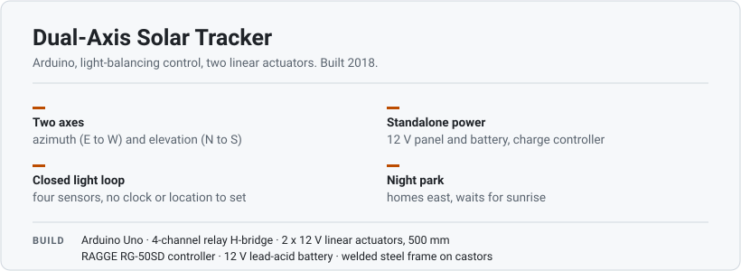
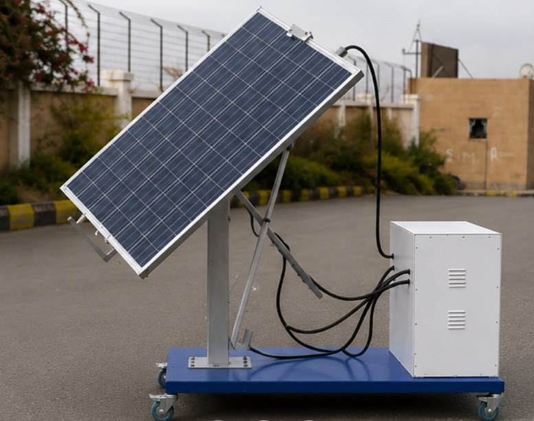
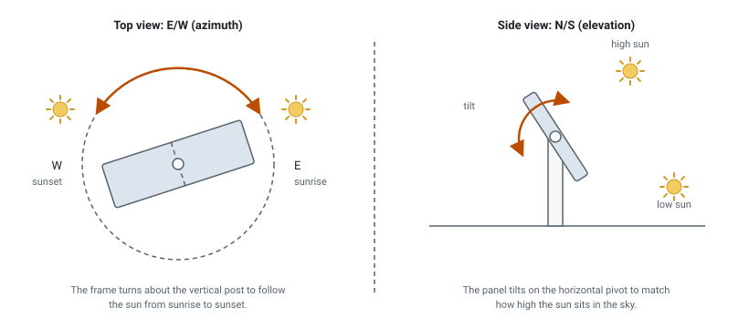
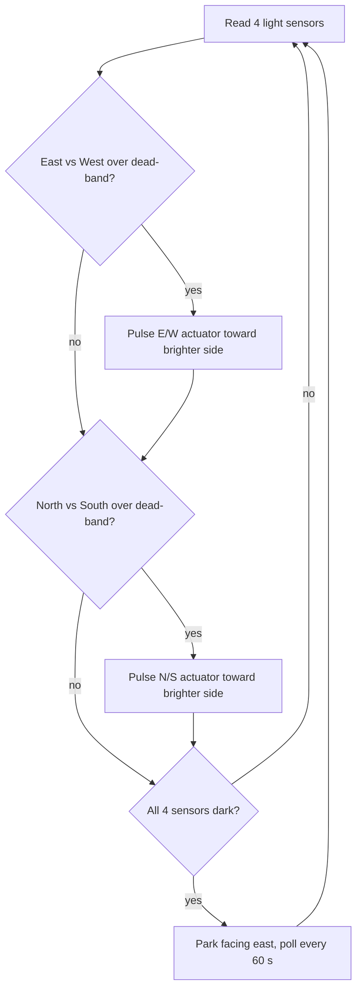
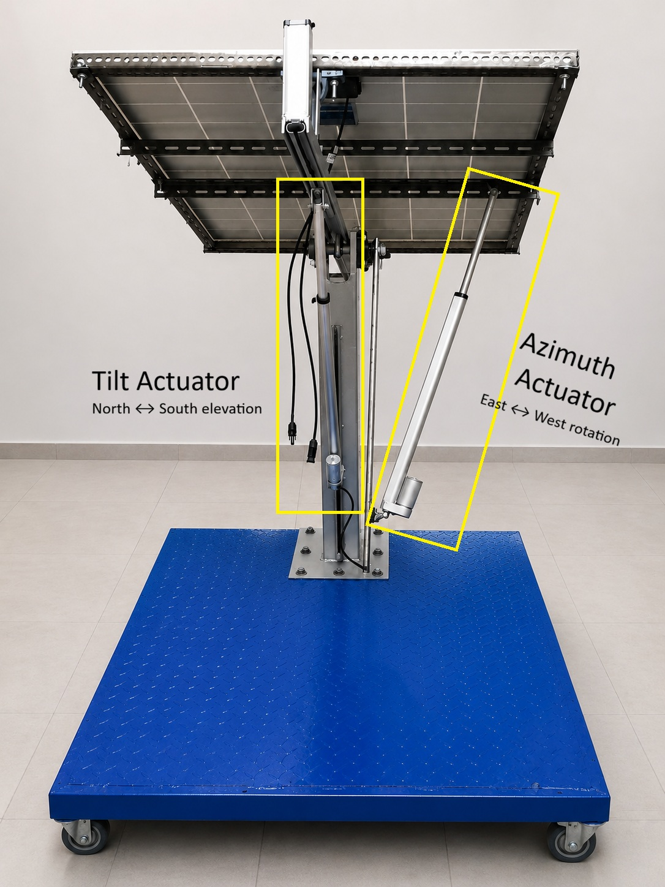
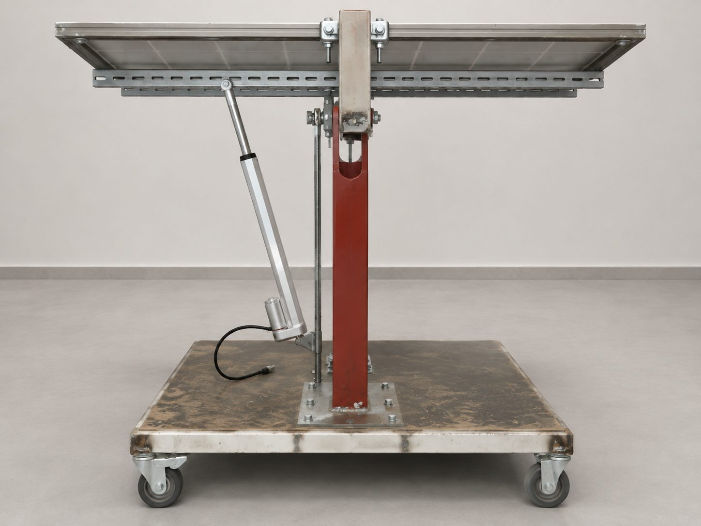
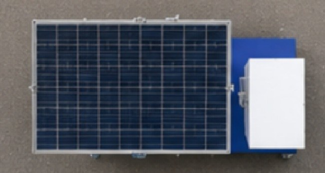
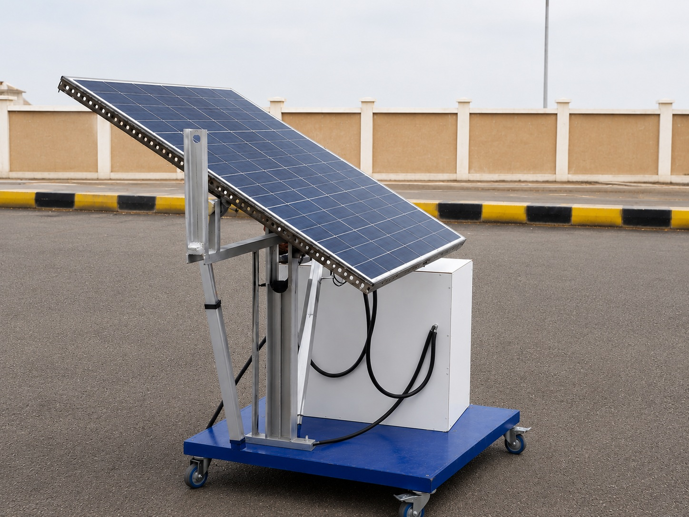

# Dual-Axis Solar Tracker



An Arduino-controlled mount that points a solar panel at the sun on two
axes. It reads four light sensors, compares opposite pairs, and drives two
12 V linear actuators until the light is balanced. Designed, built, and
tested outdoors in 2018.



## What it does

- Tracks on two axes: east/west (azimuth) and north/south (elevation).
- Uses light balancing, not a clock or sun-position maths, so there is
  nothing to set for date, time, or location.
- Parks facing east at night and waits for sunrise.
- Runs from its own panel and battery through a charge controller.

Compared with a fixed panel at a set tilt, two-axis tracking keeps the
panel closer to facing the sun through the whole day.

## How it works



The east/west axis follows the sun from sunrise to sunset. The north/south
axis sets the tilt for how high the sun sits.

The four light sensors are pre-made LDR modules (analog output), mounted
in a cross-shaped housing at the top of the panel, one facing each compass
direction, with a raised wall between each opposing pair. When the panel
is off the sun, the wall throws a shadow across one sensor of a pair. The
firmware drives that axis until the shadow clears and the pair reads
equal, which points the panel at the sun.


Each cycle the firmware:

1. reads the four sensors,
2. compares east with west; if the difference is over the dead-band, it
   pulses the east/west actuator toward the brighter side,
3. does the same for north with south,
4. if all four sensors are dark, parks facing east and checks once a
   minute until the light returns.



Light balancing was chosen over a sun-position calculation so there is no
clock or location to set, and the loop self-corrects for a panel mounted
slightly off. Linear actuators were used because they hold position with
no power and have limit switches built in, and they are driven through a
relay pair per axis for direction control. Exact thresholds and the night
behaviour are in [`docs/algorithm.md`](docs/algorithm.md).

## Mechanical design

The panel sits on a welded steel frame: a vertical post carries the
azimuth rotation (east to west) and a tilting sub-frame carries the
elevation (north to south). One linear actuator drives each axis. The base
is a plate on lockable castors.



The report sized the actuators from the panel weight and a 45-degree
travel target per axis:

| Axis | Push force | Stroke for 45 degrees |
| --- | --- | --- |
| East / West | about 28 lbf | about 22 in |
| North / South | about 40 lbf | about 18 in |

The 500 mm actuators fitted (about 20 in) cover north/south and fall a
little short of the full east/west figure, so that axis gets a bit under
45 degrees. Full spec in [`docs/hardware.md`](docs/hardware.md).

The frame was fabricated by hand: designing the mount, cutting and
grinding the steel, welding it up, drilling, and assembling and re-working
it over several revisions.

## Hardware

| Block | Part |
| --- | --- |
| Controller | Arduino Uno |
| Sensing | 4 analog light sensor modules, on A0 to A3 |
| Actuator driver | 4-channel relay board |
| Motion | Two 12 V DC linear actuators |
| Power | 12 V lead-acid battery |
| Charge control | RAGGE RG-50SD |
| Generation | 12 V polycrystalline PV panel, about 150 W |
| Frame | welded steel, on lockable castors |

The prototype was wired to a Mega 2560; the design only needs four analog
and four digital pins, so this documents it for an Uno.

Wiring and the block diagram are in [`docs/wiring.md`](docs/wiring.md) and
[`docs/hardware.md`](docs/hardware.md).

## Firmware

```
firmware/
  sun_tracker/               main control loop
  bh1750_dual_sensor_test/   BH1750 digital light sensor, tried but not used
  actuator_relay_test/       relay and actuator bring-up
  photocell_calibration/     light-level readout
  panel_fan_cooling/         fan thermostat, experiment
```

Open `firmware/sun_tracker/sun_tracker.ino` in the Arduino IDE, set the
board to Arduino Uno, and upload. The serial monitor runs at 1200
baud.

The tuning constants at the top of the sketch:

| Constant | Meaning | Value |
| --- | --- | --- |
| `EW_DEADBAND` | east/west difference to ignore | 10 |
| `NS_DEADBAND` | north/south difference to ignore | 20 |
| `NIGHT_LEVEL` | all four sensors below this means night | 30 |
| `STEP_MS` | actuator on-time per pulse | 800 ms |
| `READ_PERIOD_MS` | pause between sensor reads | 5000 ms |

## Testing

The tracker was run outdoors over full days and its output compared
against a fixed panel at a set tilt. The sensor readings were also checked
against light level during setup. The original test logs from 2018 have
not been kept.

## What the build involved

Firmware in Arduino C++, the relay H-bridge electronics and the standalone
12 V power path, the mechanical design and hand fabrication of the steel
frame, and integration into a working outdoor unit.

## Gallery

| Frame and base | Top view | Another angle |
| --- | --- | --- |
|  |  |  |

## Limitations

- The control is on/off with a dead-band, so the panel dithers a little
  near the balance point and does not seek a true power maximum.
- Moves are timed, not measured by angle.
- The analog sensors are not shielded, so motor noise can disturb the
  readings.
- No flyback diode or snubber on the relay-switched actuators.
- The panel sits off-centre on the wheeled base, so the rig is less stable
  when the frame is turned, and there is no wind stow.

## Repository layout

```
firmware/   Arduino sketches
docs/       hardware, wiring, algorithm
images/     photos and diagrams
```

## Notes

Built and tested in Sana'a in 2018. Published here later from an archived
project folder, which is why the git history is a single commit.

Only a few original photos survived and most were low quality, so the
build shots have been cleaned up with AI editing (background removed,
sharpened). They are based on real photos of the rig. The diagrams
(overview card, axes, sensor housing, block diagram, H-bridge) are
hand-drawn SVGs.

## License

[MIT](LICENSE), 2018 Abobakr Alawi Al-Anbasah.
