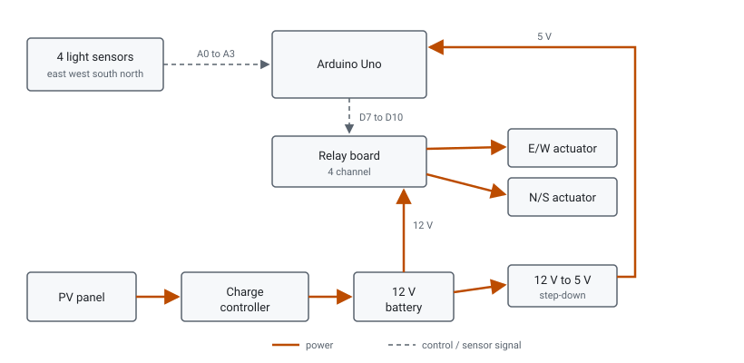

# Hardware

## Parts

| Block | Part |
| --- | --- |
| Controller | Arduino Uno |
| Light sensing | 4 LDR light-sensor modules (analog out), in a shaded cross-shaped housing |
| Actuator driver | 4-channel relay board |
| Motion | 2 x 12 V DC linear actuators, one per axis |
| Power | 12 V lead-acid battery |
| Charge control | RAGGE RG-50SD |
| Generation | 12 V polycrystalline PV panel, about 150 W |
| Structure | welded steel frame on a castored base |

A BH1750 digital light sensor was also tried (see
[`firmware/bh1750_dual_sensor_test`](../firmware/bh1750_dual_sensor_test)).
The build uses the analog sensors.

## Linear actuators

Datasheet figures for the units used (not independently measured):

- 12 V DC, about 500 mm stroke
- around 1000 N max push
- under 1 A no-load, up to about 3 A under load
- built-in limit switches at both ends
- IP54 rated

The same actuator was used on both axes. The firmware drives an actuator
until the sensors balance or it hits its own end stop, so no position
feedback is needed. The design target was up to 45 degrees of travel per
axis.

## Power path

The panel charges the battery through the controller. The battery feeds
the Arduino at 5 V through a step-down, and the relay board at 12 V. The
relays switch 12 V to the actuators; the Arduino only drives the relay
coils.

## Structure

- Azimuth (E/W): the upper frame turns about the vertical post.
- Elevation (N/S): the panel sub-frame tilts on a horizontal pivot.
- One linear actuator drives each axis.
- The base is a steel plate on lockable castors.
