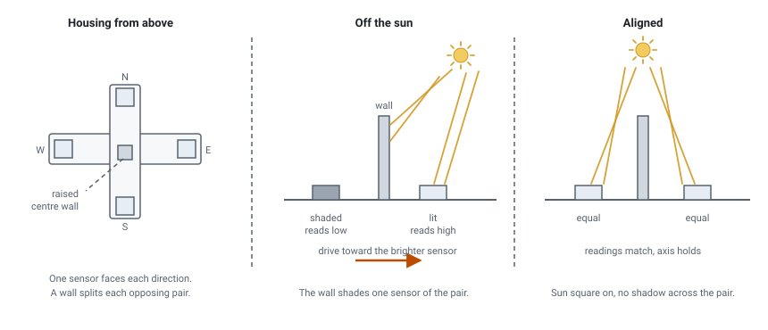
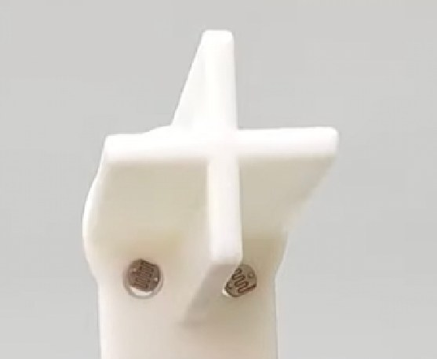
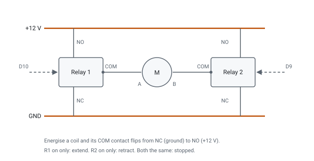

# Wiring

## Arduino Uno pin map

| Pin | Connection |
| --- | --- |
| A0 | East light sensor |
| A1 | West light sensor |
| A2 | South light sensor |
| A3 | North light sensor |
| D10 | East/West actuator relay, channel 1 |
| D9 | East/West actuator relay, channel 2 |
| D8 | North/South actuator relay, channel 1 |
| D7 | North/South actuator relay, channel 2 |

The Uno's I2C pins (A4/A5) are only used by the BH1750 test sketch, not
the analog-sensor build.

## Light sensors

Four pre-made LDR light-sensor modules (analog output), one per compass
direction, mounted in a cross-shaped housing at the top of the panel. A
raised wall separates each opposing pair, so off-axis the wall shades one
sensor more than its opposite.

The modules are plug and play: each has its own divider on board, so the
wiring is just VCC, GND, and the analog output pin (AO) to one of A0 to
A3. The output falls as light rises, so the firmware uses
`1023 - analogRead(pin)` and a bigger number means brighter. The tracker
drives each axis to clear the shadow, toward the brighter sensor.

## Actuators via relays

Each actuator uses two relay channels so its 12 V supply can be reversed.

| Channel 1 | Channel 2 | Result |
| --- | --- | --- |
| ON | OFF | extends |
| OFF | ON | retracts |
| OFF | OFF | stopped |
| ON | ON | stopped |

The sketch drives a relay pin HIGH to switch it. If your relay board is
active-LOW, invert the HIGH and LOW values in the sketch.
